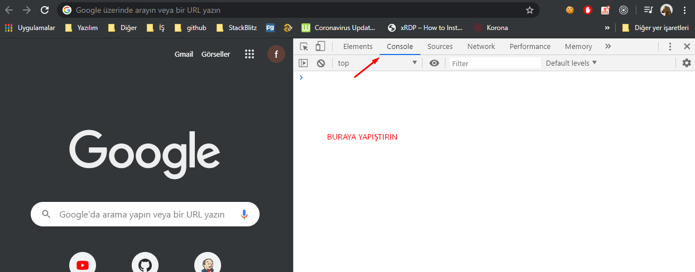

## TEST SORULARIN ÇÖZÜMLERİ BURAYA EKLENECECTİR

## Nasıl çalıştırırım.
- Çözümünü merak ettiğiniz soruları *.js dosyası var ise dosyayı açınız.
- Google Chrome, Mozilla Firefox, Safari gibi tarayıcılarda `console`'u açmanız gerekiyor. Google Chrome için bu tuş F12 
- Ardında dosyadaki tüm kodları kopyalayıp, `console`'a yapışırıp enter'a basınız.
